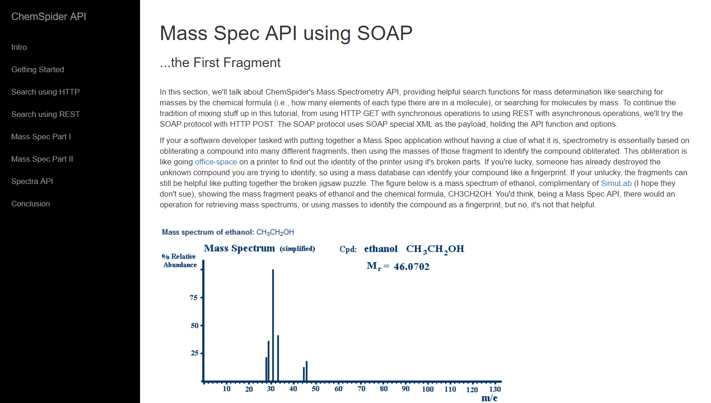

# ChemSpider API How-To

## Overview

A [Bootstrapped](https://getbootstrap.com/) how-to covering the old [ChemSpider API](https://developer.rsc.org/) to access chemical information programmically.

## Link to Assignment

[ChemSpider API How-To](http://159.89.136.195:8883/)

## Improvements
- Revamp for the newer RESTful ChemSpider API (it is no longer sleepy)
